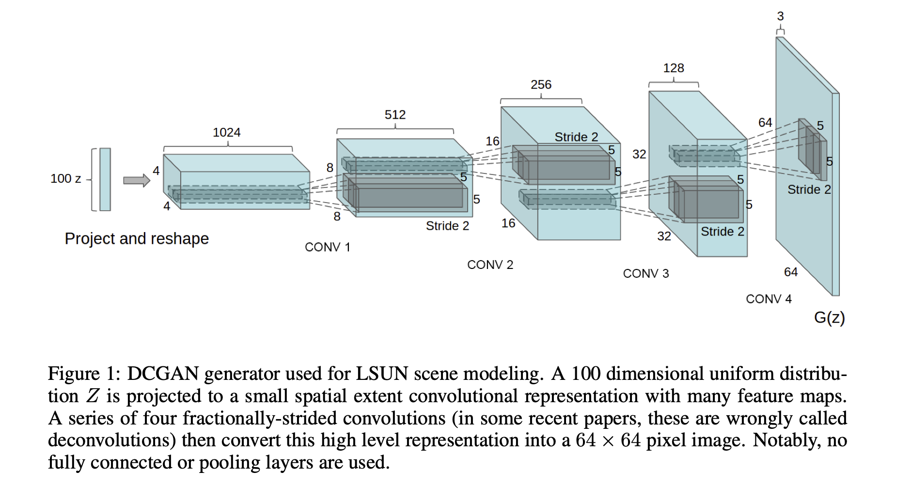

This DCGAN architecture is based on Radford et al.'s Unsupervised representation learning with deep convolutional generative adversarial networks, where the generator consists of

1. transposed convolutional layers
2. BatchNorm
3. ReLU

